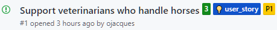

Tu eres Dan el desarrollador

y estás trabajando en la historia que ha sido priorizada por Paulo, el Product Owner.

Lee la historia que se encuentra registrada con un GitHub Issue en tu repositorio:
[https://github.com/[your_username]/pet-clinic/issues](https://[[HOST_SUBDOMAIN]]-9876-[[KATACODA_HOST]].environments.katacoda.com/#user-story)

# Implementa la nueva Historia

✏ Nota: Para facilitar la parte práctica, modificarás el código fuente directamente desde navegador, a través de la interfaz gráfica de Github.

## Agrega una nueva categoría de mascotas en la BD 

* Abre Github y navega hasta el archivo [`src/main/resources/db/hsqldb/data.sql`](https://[[HOST_SUBDOMAIN]]-9876-[[KATACODA_HOST]].environments.katacoda.com/#datasql). Este archivo es utilizado para poblar la data cuando levanta la aplicación.

* Para editar el archivo, click en el **ícono de lapiz** en la parte superior derecha del archivo.
  
* Debajo de la línea 51 `INSERT INTO pets VALUES (13, 'Sly', '2012-06-08', 1, 10);` agrega las siguientes líneas para agregar dos nuevos caballos:

  <pre class="file" data-target="clipboard">
  INSERT INTO pets VALUES (14, 'Jolly Jumper', '2012-09-20', 7, 5;
  INSERT INTO pets VALUES (15, 'Flycka', '2012-07-14', 7, 9);
  </pre>

* No realices commit de los cambios aún.

✏ Nota: Hay un error intencional en la línea de "Jolly Jumper", para que puedas ver las verificaciones automaticas que se ejecutarán como parte de Continus Integration.