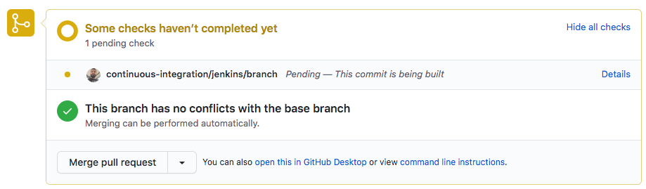
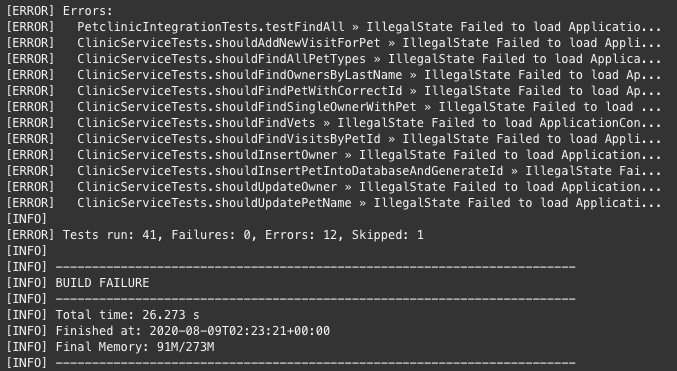

## Revisión del Pull Request

* Te encontrarás en la pantalla del **Pull Request**.

* A mitad de la página observarás el mensaje **Some checks haven't completed yet**. 

✏ **Nota**: Apenas se creó el pull request, Github notificó a Jenkins que ejecuté el pipeline y que le retorne el resultado de esa ejecución.

## Ejecución del Job en Jenkins

* Ingresa a Jenkins para ver qué está sucediendo <a href="https://[[HOST_SUBDOMAIN]]-8080-[[KATACODA_HOST]].environments.katacoda.com/blue/organizations/jenkins/pet-clinic/activity/" target="jenkins">https://[[HOST_SUBDOMAIN]]-8080-[[KATACODA_HOST]].environments.katacoda.com/blue/organizations/jenkins/pet-clinic/activity/</a>

* Observarás que está en progreso (o finalizó) la ejecución de un pipeline asociado al Pull Request.

* Haz click en la ejecución para revisar su detalle.

* Al inicio de la página verás el gráfico de ejecución del pipeline (si ya terminó la ejecución, te mostrará directamente los logs de error, desplázate hasta el inicio de la página).

* Las tareas que ejecuta este pipeline son las siguientes:
  - Descargar las dependencias de la aplicación (etapa 'Build').
  - Compilar la aplicación (etapa 'Build').
  - Ejecutar Pruebas Unitarias (etapa 'Build').
  - Ejecutar Pruebas de Integración (etapa 'Build').
  - Archivar y Publicar los Resultados de las Pruebas (etapas 'Archive and Publish Unit Tests Results').

* La etapa **Build** ha encontrado un error. Haz click en esta etapa y revisa brevemente los logs, encontrarás que algunas pruebas han fallado.

## ¿Cuál es la mecánica de funcionamiento?

* Cuando el Pull Request es creado, GitHub notifica a Jenkins a través de un Web Hook.
  
  ✏ **Nota**: Los **Web Hook** se usan para notificar a otras aplicaciones de eventos en Github, como por ejemplo la creación de un Pull Request. Opcionalmente puedes revisar la configuración del web hook en [https://github.com/[your_username]/pet-clinic/settings/hooks](https://[[HOST_SUBDOMAIN]]-9876-[[KATACODA_HOST]].environments.katacoda.com/#hooks).

* Cuando Jenkins es notificado, lee el contenido del archivo **Jenkinsfile** en la raiz del repositorio de código. Este archivo tiene la implementación de todas las etapas del pipeline de Integración Continua.
  
* Cada etapa obtenida del Jenkinsfile es ejecutada en el servidor de Jenkins.