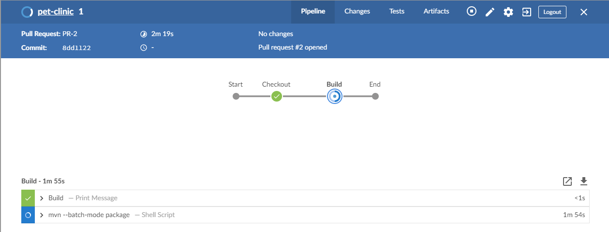

## Ejecución del Job en Jenkins

Ingresa a Jenkins para ver qué está sucediendo <a href="https://[[HOST_SUBDOMAIN]]-8080-[[KATACODA_HOST]].environments.katacoda.com/blue/organizations/jenkins/pet-clinic/activity/" target="jenkins">https://[[HOST_SUBDOMAIN]]-8080-[[KATACODA_HOST]].environments.katacoda.com/blue/organizations/jenkins/pet-clinic/activity/</a>

Observarás que se inició la ejecución de un nuevo pipeline, las etapas ('stages') que tiene este pipeline son las siguientes:
- Descargar las dependencias de la aplicación.
- Compilar la aplicación.
- Ejecutar Pruebas Unitarias.

## ¿Cuál es la mecánica de funcionamiento?

* Cuando el Pull Request es creado, GitHub notifica a Jenkins a través de un Web Hook.
  
  ✏ Note: Los **Web Hook** se usan para notificar a otras aplicaciones de eventos en Github, como por ejemplo la creación de un Pull Request. Opcionalmente puedes revisar la configuración del web hook en [https://github.com/[your_username]/pet-clinic/settings/hooks](https://[[HOST_SUBDOMAIN]]-9876-[[KATACODA_HOST]].environments.katacoda.com/#hooks).

* Cuando Jenkins es notificado, lee el contenido del archivo **Jenkinsfile** en la raiz del repositorio de código. Este archivo tiene la implementación de todas las etapas del pipeline de Integración Continua.
  
* Cada etapa del pipeline obtenida del Jenkinsfile es ejecutada en el servidor de Jenkins.

## Revisa el resultado del Pipeline

* Revisa el resultado del pipeline, observa que la etapa **build** ha encontrado un error.

* Click en la etapa que tiene el error y revisa brevemente los logs de error, encontrarás que algunas pruebas han fallado.