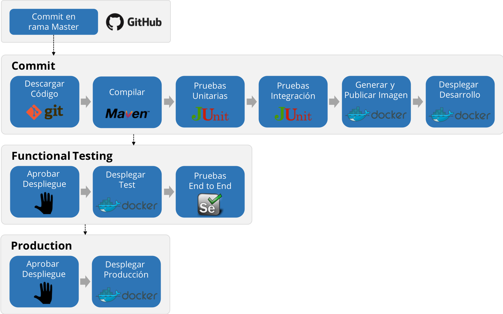

El delivery pipeline que implementaremos tendrá la siguientes características.

* **Iniciará apenas se detecte un cambio en la rama** `Master`.
  
* **Incluirá las etapas del pipeline de Continuous Integration**: Compilar, Pruebas Unitarias,  Pruebas de Integración, Generar y Publicar la Imagen Docker, Desplegar en Desarrollo.

* Tendrá etapas adicionales que permitan **llevar la imagen docker a través del ambiente de test hasta producción**.
  
* Tendrá **etapas automatizadas** (Desplegar, Pruebas End-to-End) **y etapas manuales** (Aprobaciones)

En los siguienes pasos agregarás las nuevas etapas al pipeline.