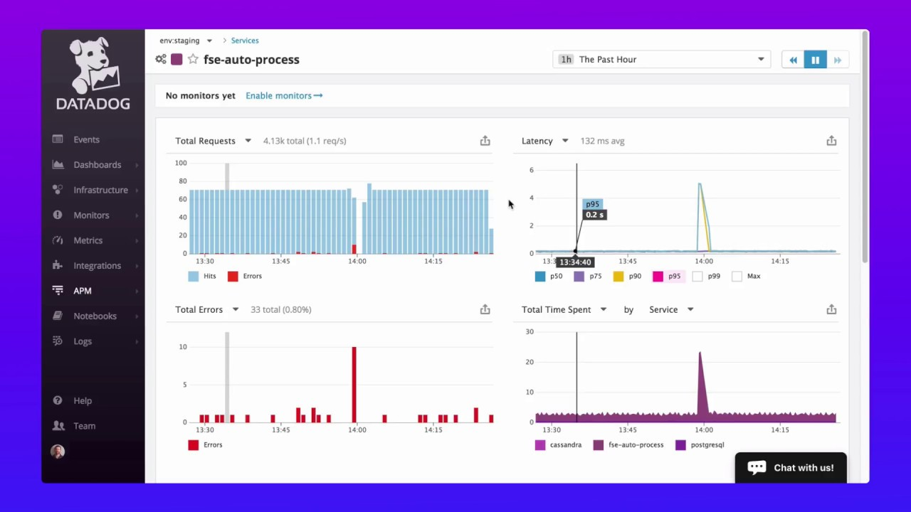
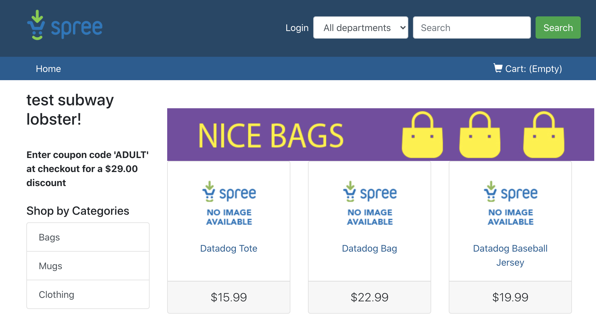

## Configura tu espacio de trabajo
 
Ejecuta el siguiente comando para:
- Descargar el código fuente.
- Levantar todos los componentes de la aplicación.

`./prepare.sh`{{execute}}

**Mientras se ejecuta el script CONTINUA AVANZANDO con el resto de este Step.**

## Datadog

Utilizaremos <a href="https://www.datadoghq.com/" target="datadog">Datadog</a> como plataforma de observabilidad que nos permitirá obtener y visualizar métricas, eventos y traces de nuestra aplicación.

## Crea tu cuenta

Ingresa a <a href="https://www.datadoghq.com/" target="datadog">https://www.datadoghq.com/</a> y crea una cuenta haciendo clic en el botón **Get Started Free**.

## Genera en API Key

Genera un API Key que se utilizará para conectar los agentes que se instalarán en la instancia con el servicio de Datadog.

* Ingresa a [https://app.datadoghq.com/organization-settings/api-keys](https://app.datadoghq.com/organization-settings/api-keys)
* Click en **New Key.**
* Ingresa un nombre del key, por ejemplo `DevOps Labs Key`{{copy}}
* Copia y guarda el **KEY** generado.

## La Aplicación

En este laboratorio trabajarás un Ecommerce completamente funcional que tiene los siguientes componentes ejecutándose como contenedores:

- `frontend`: Spree e-commerce framework escrito en Ruby.
- `discounts`: servicio Python que maneja los descuentos.
- `advertisements`: servicio Python que maneja las publicidades.
- `db`: base de datos PostgreSQL usada por los servicios.

**Nota:** La aplicación tiene intencionalmente algunos errores para que podamos identificarlos aplicando los elementos de Observabilidad.
## (Opcional) Levanta la Aplicación

Abre la aplicación utilizando el siguiente enlace:
<a href="https://[[HOST_SUBDOMAIN]]-3000-[[KATACODA_HOST]].environments.katacoda.com/" 
  target="jenkins">https://[[HOST_SUBDOMAIN]]-3000-[[KATACODA_HOST]].environments.katacoda.com/</a>

## El Agente de Monitoreo

💡 **Importante**: Para realizar este paso es necesario que termine el script anterior de preparación.

Los agentes de DataDog se instalan en los hosts y se encargan de reportar las métricas y eventos desde la instancia hacia Datadog.

Realiza los siguientes pasos para agregar el API KEY al entorno del laboratorio:
* Copia y pega este comando en el terminal `export DD_API_KEY=REPLACE_ME`{{copy}}.
* Reemplaza el placeholder `REPLACE_ME` por tu **KEY** previamente generado.
* Ejecuta el comando.

Ejecuta el siguiente comando para instalar el agente de DataDog. Al levantar el agente utilizará tu **KEY** para conectarse con Datadog.

`./startAgent.sh`{{execute}}

**La descarga e inicialización toma un par de minutos en ejecutarse**

Espera el mensaje **Click on 'CONTINUE'**.