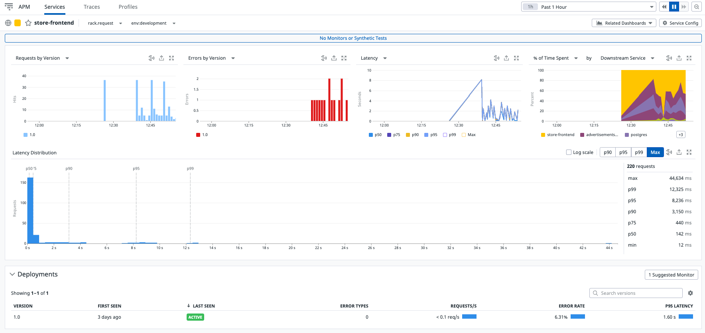

## Mapa de los Servicios de la Aplicación

Ingresa a esta url para observar el mapa en tiempo real de todos los servicios (componentes) de la aplicación y sus dependencias.
<a href="https://app.datadoghq.com/apm/map" target="datadog">[Service Map](https://app.datadoghq.com/apm/map)</a>

Este mapa descompone la aplicación en todos sus servicios y pinta las dependencias en tiempo real, de tal manera que puedas identificar rápidamente cuellos de botella y cómo fluye la información en tu arquitectura

Por cada servicio observarás sus `requests`, `errors`, `latency` para visualar rápidamente problemas.

En caso que algún componente presente alguna alerta este aparecerá pintado de un color diferente.

## Revisa el detalle de 1 servicio

Haz click en el cuadro del servicio `store front`, aparecerá un menu contextual, haz click en `View Service Overview` para ver todo el detalle del servicio.

Observarás bastante información del servicio como `requests`, `errors`, `latency`, `endpoints`, `metrics`.