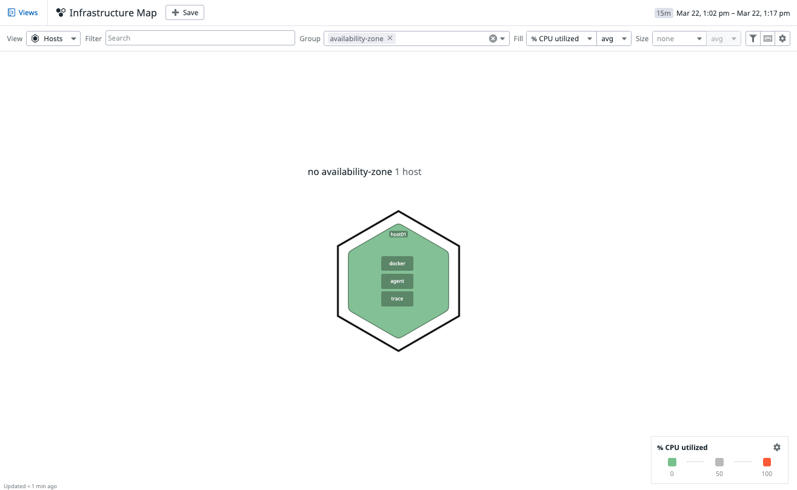
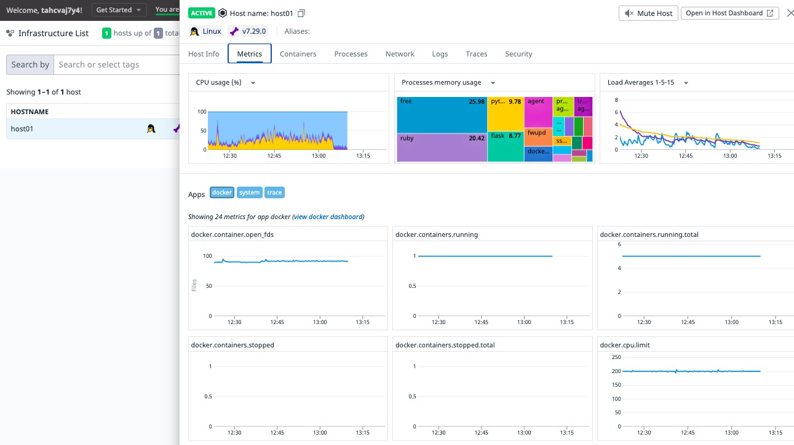
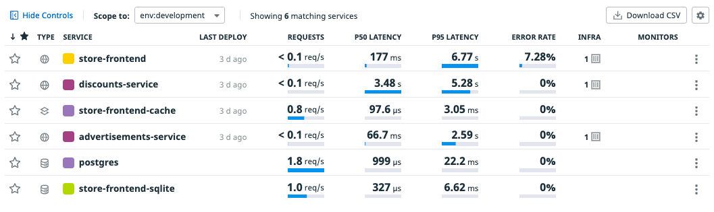

## Observabilidad a Nivel de Instancias

**Mapa de las Instancias**

Para ver un un mapa general de todas las instancias y su salud, en el meneu de la izquierda ingresa a `Infrastructure` > `Host Map`.

Observarás que solo hay 1 instancia que tiene buena salud.

**Detalle de las Instancias**

Para ver el detalle de 1 instancia, en el menú de la izquierda ingresa a `Infrastructure` > `Infrastructure List`, click en `host01`

Se desplegará una ventana con toda la información de la instancia.

En los tabs de la ventana emergente, haz click `Metrics` para observar el detalle de las métricas de la instancia.

(Opcional) Haz click en `logs` para ver todos los logs de la instancia.

## Observabilidad a Nivel de Contenedores

Para ver el detalle de las métricas a nivel de contenedores, en el menú de la izquierda ingresa a `Infrastructure` > `Containers`.

Observarás al menos 2 métricas importantes a este nivel
- `% CPU`: porcentaje de cpu utilizado
- `RSS Memoria`: cantidad de memoria ocupada.

## Observabilidad a Nivel de Servicio (Componente)

Para ver el listado de servicios y un resumen de sus principales métricas, en el menú de la izquierda ingresa a `APM` > `Services`.

Observarás 3 métricas muy importantes:
- `Requests`: cantidad de llamadas por segundo.
- `Latency`: tiempo de respuesta.
- `Error Rate`: Porcentage de requests que presentaron error.

## (Opcional) Observabilidad a Nivel de Base de Datos

TBD

