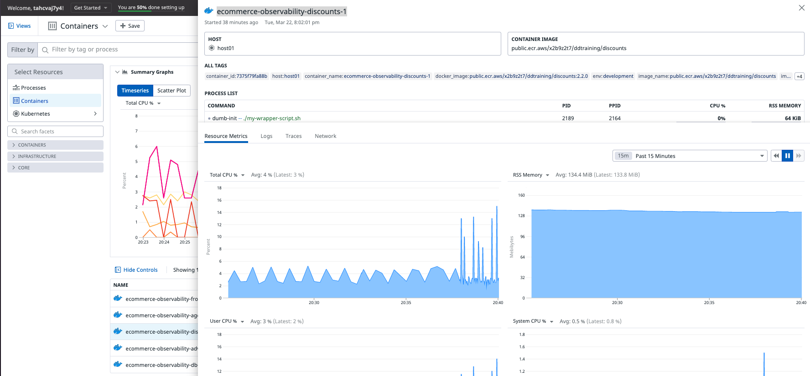

## Observabilidad a Nivel de Instancias

**Mapa de las Instancias**

Para ver un un mapa general de todas las instancias y su salud, en el menú de la izquierda ingresa a **Infrastructure > Host Map**.

Observarás 1 sola instancia con algunas aplicaciones corriendo encima (docker, trace, agent), el color representa el cpu utilizado y es verde ya que la utilización es baja.

**Detalle de las Instancias**

Para ver el detalle de 1 instancia, en el menú de la izquierda ingresa a **Infrastructure > Infrastructure List**, click en **host01**.

Se desplegará una ventana emergente con toda la información de la instancia.

En la ventana emergente, haz click en el tab **Metrics** para observar el detalle de las métricas de la instancia.

(Opcional) Haz click en el tab **logs** para ver todos los logs de la instancia.

## Observabilidad a Nivel de Contenedores

Para ver el detalle de las métricas a nivel de contenedores, en el menú de la izquierda ingresa a **Infrastructure > Containers**.

Observarás al menos esta métricas importantes a este nivel
- `% CPU`: porcentaje de cpu utilizado
- `RSS Memoria`: cantidad de memoria ocupada.
- `TX`: cantidad de bytes transmitidos.
- `RX`: cantidad de bytes recibidos.

Haz click en el container **ecommerce-observability-discounts-1**.

En la ventana emergente observarás los **resource metrics** del contenedor.

(Opcional) Haz click en el tab **logs** para ver los logs del container 

**Nota:** Espera unos segundos a que aparezcan los logs en tiempo real del último minuto o cambia el tiempo de visualización a **past 15 minutes**.

## Observabilidad a Nivel de Servicios (Componentes)

Para ver el listado de servicios y un resumen de sus principales métricas, en el menú de la izquierda ingresa a **APM >Services**.

Haz click en el servicio **store-frontend** para ver el detalle del servicio.

Observarás bastante información del servicio como `requests`, `errors`, `latency`, `endpoints`, `metrics`.
