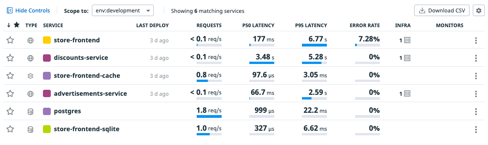

## Identificar Problemas

Regresa a la pantalla con el listado de servicios (**Service List**)

En esta pantalla observarás que hay al menos 2 cosas interesantes de analizar:
- **Errores** en `store-frontend`
- **Lentitud** en las llamadas.

Estos problemas los analizaremos y corregiremos a continuación.