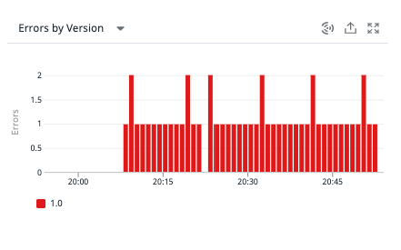
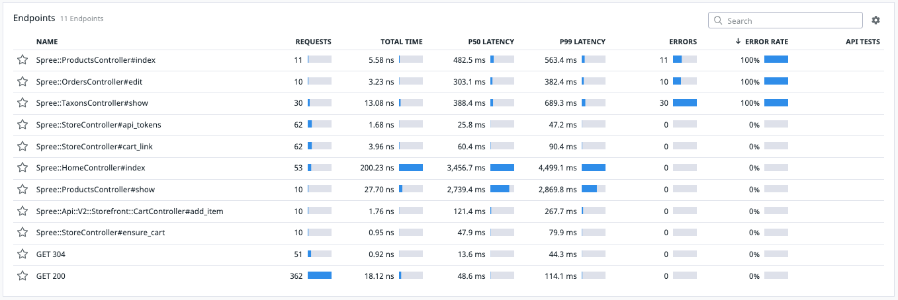
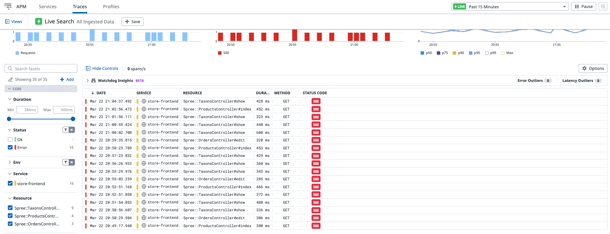
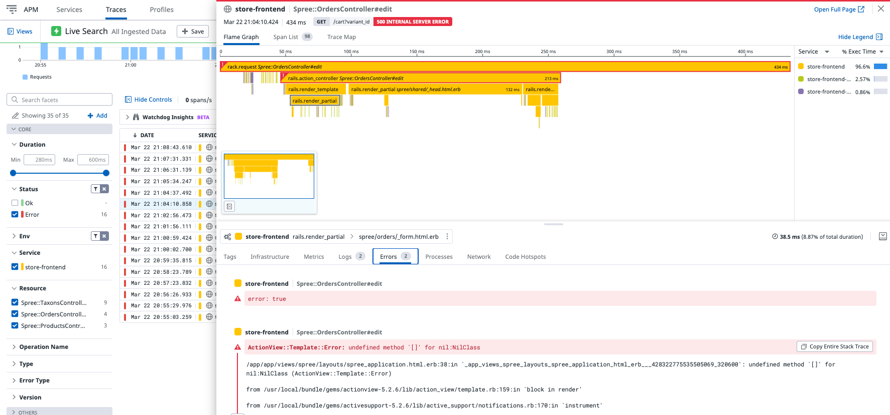

## Analizar el Problema

**Revisar la métrica de errores**

En la pantalla con el listado de servicios (**APM > Services**), haz click en **store-frontend** para ver el detalle de información.

Observa que el gráfico de `Total Errors` muestra varios errores a lo largo del tiempo.

Desplázate hacia abajo para ver el disgregagado de los **Endpoints** y cuáles podrían estar causando el problemas.

Ordena la tabla de endpoints por **Error Rate** haciendo click en el título de su columna correspondiente.

**Profundizar en los errores**

Para revisar todos los traces, en el menu de la izquierda ingresa a **APM > Traces**.

Filtra para que muestre solo los **Status > Error**.

Haz click sobre cualquier trace, por ejemplo **Spree::OrdersController#edit** para observar el detalle del trace.

En la ventana emergente, en los tabs de la sección inferior haz click sobre el tab **Errors**.

Observarás la línea exacta donde se está generando el error: **/app/app/views/spree/layouts/spree_application.html.erb:38**.

(Opcional) Ingresar a diferentes traces para observar el mismo error.

**Revisa el archivo con el problema**

Abre el archivo `./store-frontend/app/views/spree/layouts/spree_application.html.erb`{{open}} y dirígete a la línea con el error.

En un próximo paso corregiremos el problema.