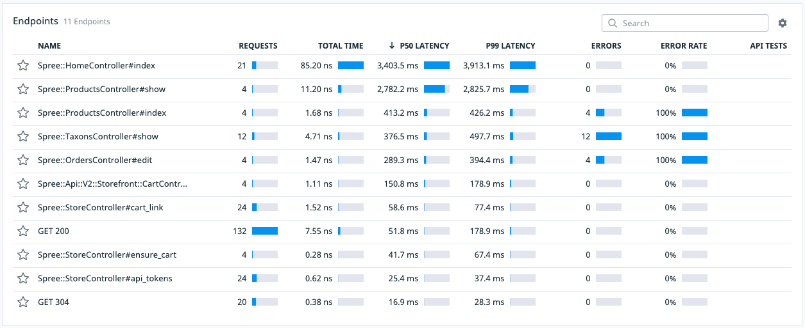
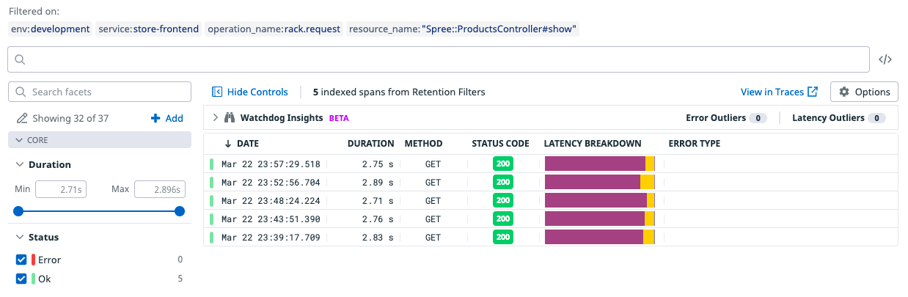
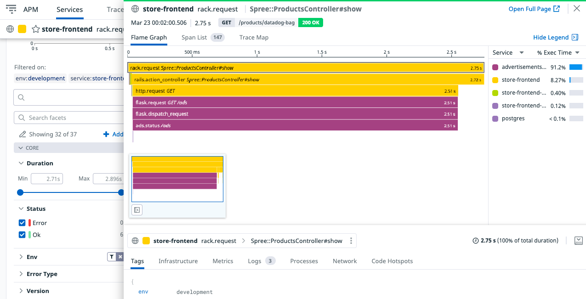
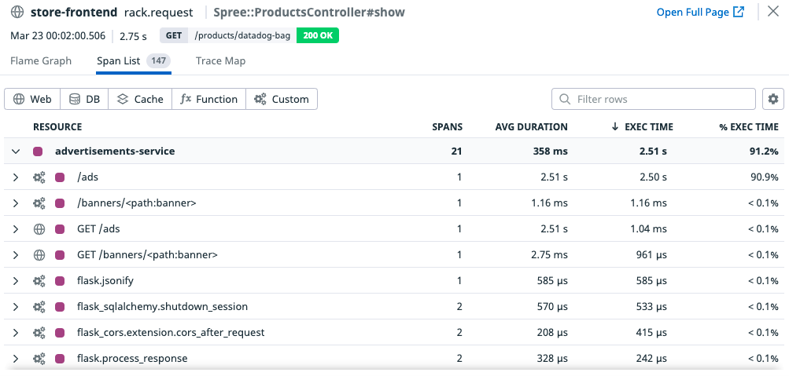
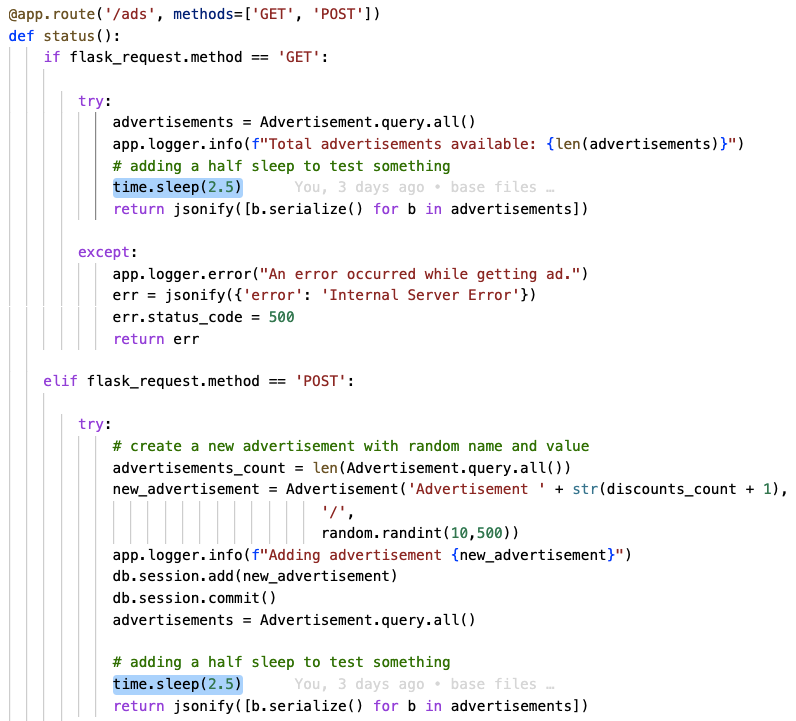

## Analizar el Problema

**Revisar el Latency de los Endpoints**

En la pantalla con el listado de servicios (**APM > Services**), haz click en **store-frontend** para ver el detalle de su información.

Desplázate hacia abajo para ver el listado **Endpoints**, ordénalos por **P50 Latency** para identificar donde se encuentra el problema.

**Profundizar en la lentitud**

Hay varios endpoints con lentitud.

Comienza haciendo click sobre el endpoint **Spree::ProductsController#show**.

En la nueva página, desplázate hacia abajo hasta encontrar un **Listado de Traces** de los últimos requests que ingresaron por ese endpoint.

Haz click sobre el primero de los traces para ver el detalle.

Observarás el **Flame Graph**, lista de spans de este trace desde el front hasta la BD.

Haz click en el tab **Span list** y ordena los span por **exec time**.

Observarás que el span que más tiempo de ejecución consume es **advertisements-service > /ads**

**Abre el archivo con el problema**

Abre el archivo `./ads-service/ads.py`{{open}} y dirígete al endpoint **/ads**.

Observarás que hay un `time.sleep(2.5)` (intencionalmente colocado para incrementar los tiempos de respuesta.)

En un próximo paso corregiremos el problema.

**(Opcional) Identifica el resto de problemas de lentitud**

Hay otros endpoints con problemas de lentitud, realiza los pasos anteriores para identificar el lugar exacto de lentitud.