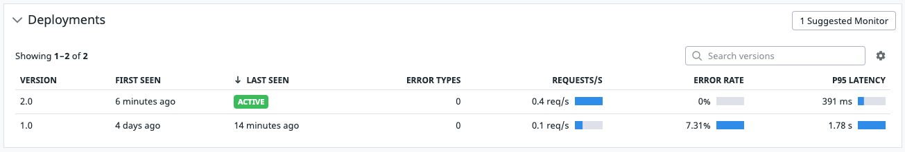
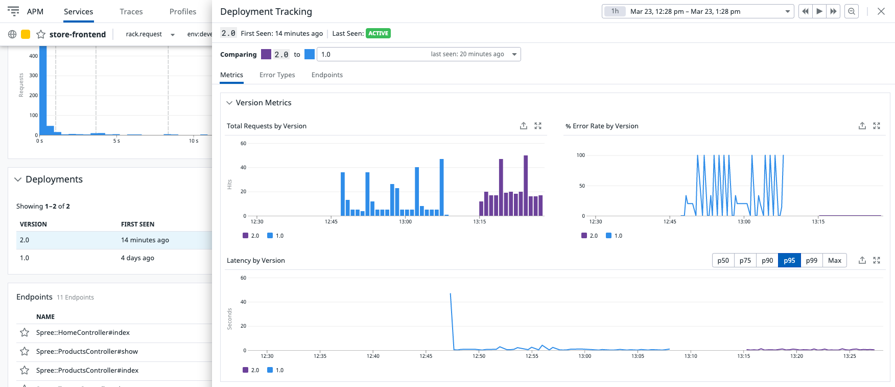
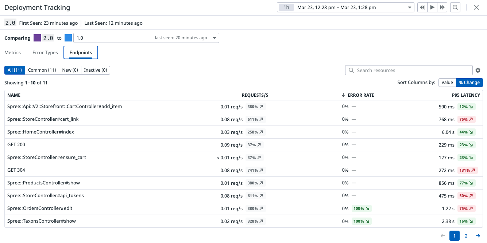

## Corregir los Problemas

**Apaga todos los servicios**

Ejecuta el siguiente comando para apagar todos los servicios.

`docker-compose -f ecommerce-observability/docker-compose.yml down`{{execute}}

**Aplica un parche para corregir el problema**

Ejecuta los siguientes comandos para aplicar los parches con las correcciones a los problemas anteriores.

- `cd ecommerce-observability`{{execute}}
- `patch -t -p1 < store-front.patch`{{execute}} (corrección a los errores en el front).
- `patch -t -p1 < discounts-service.patch`{{execute}} (corrección a la lentitud en algunas llamadas).

**(Opcional) Abre los parches anteriores para observar qué se está cambiando**

- `store-front.patch`{{open}}
- `discounts-service.patch`{{open}}

## Actualizar la versión y levantar la aplicación 

**Cambia la versión**

Abre el archivo `docker-compose.yml`{{open}} que contiene la definición de todos los contenedores de la aplicación.

Encontrarás que en **3 lugares** está la sentencia **DD_VERSION=1.0**.

Ejecuta el siguiene comando para reemplazar todas las ocurrencias por **DD_VERSION=2.0**.

`sed -i 's/DD_VERSION=1.0/DD_VERSION=2.0/g' docker-compose.yml`{{execute}}

**Actualiza la imagen docker del frontend**

**Nota:** El frontend es un componente que necesita re-buildearse antes de volver a levantar. Los servicios en python levantan directamente desde el código fuente sin hacer build.

Para no hacer un re-build de todo el frontend, vamos a actualizar directamente la imagen docker del frontend por una que ya tiene la corrección.

Ejecuta el siguiente comando para reemplazar el nombre de la imagen del frontend por una imagen que ya tiene la corrección.

`sed -i 's/storefront:2.2.0/storefront-fixed:2.2.0/g' docker-compose.yml`{{execute}}

**Levanta todos los servicios**

Ejecuta los siguientes comandos para levantar todos los servicios.

`(cd /root && ./prepare.sh)`{{execute}}
`(cd /root && ./startAgent.sh)`{{execute}}

## Comparar el desempeño de ambas versiones de la aplicación

**Revisar las versiones de la aplicación desplegadas**

Ingresa a la lista de servicios, en el menú de la izquierda ingresa a **APM > Services**.

Haz click en el servicio **store-frontend** para ver su detalle.

Desplázate hacia abajo, hasta la sección **Deployments**.

Observarás 2 deployments.
- `1.0`: la versión con los errores y lentitud.
- `2.0 Active`: la versión con las correcciones y que acabamos de levantar.

Asimismo, las principales métricas de ambas versiones: 

**Comparar el desempeño de ambas versiones**

Haz click sobre la versión **2.0**, se abrirá una ventana emergente con la comparación entre el desempeño de las 2 versiones.

Observarás que la versión 2.0 tiene menos `errors` y menor `latency` (velocidad) en comparación con la versión 1.0.

En la ventana emergente, haz click en el tab **Endpoints** para ver la comparación a nivel de endpoints.

