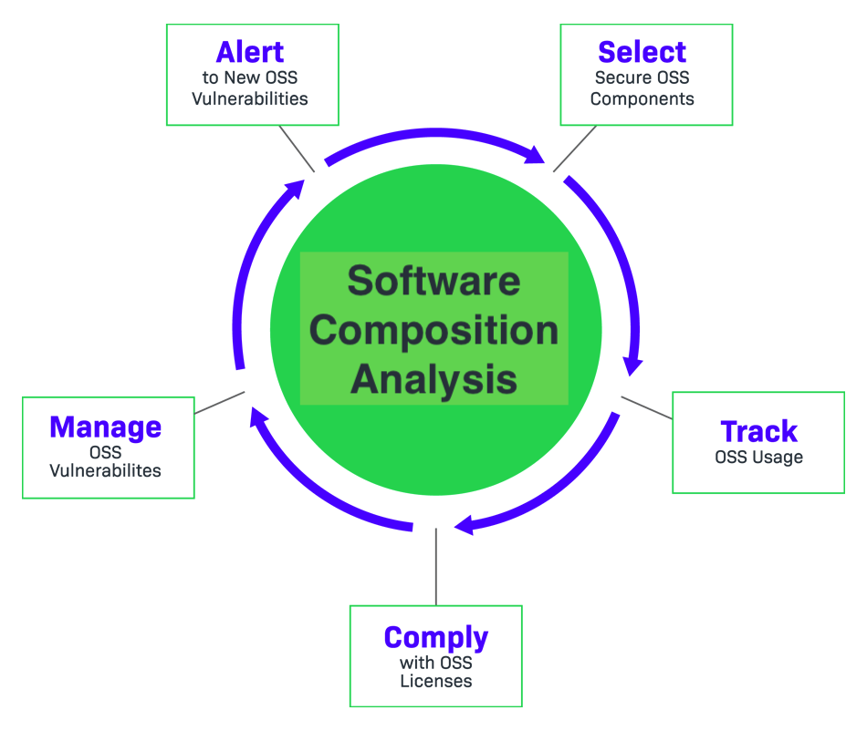

Una de las preocupaciones principales del equipo son las dependencias que se utilizan en el código fuente, ya que vulnerabilidades se encuentran continuamente en librerías open source. Comprobar que las dependencias no se vuelven vulnerables con el tiempo será clave para proteger los datos personales de los clientes.

**Software Composition Analysis (SCA)**

Las herramientas de SCA se ocupan de la gestión del uso de componentes open source, para lo cuál realizan un análisis del código fuente, incluyendo artefactos relacionados como dependencias y contenedores, para identificar:

* Todo el inventario de componentes open source utilizado.
* Vulnerabilidades de seguridad conocidas en estos componentes.
* Compatibilidad de las licencias con las políticas de la organización.

Hay muchas herramientas que se pueden usar, incluidas las de código abierto, como [OWASP Dependency Check](https://owasp.org/www-project-dependency-check/). 

Debemos ejecutar este control no solo cuando se introduce cambios en el código (pipeline de integración continua), sino también de forma regular. De esta manera, si se descubre una vulnerabilidad en una de las dependencias, el pipeline de CI la detectará y notificará para tomar medidas. 

**OWASP (Open Web Application Security Project)**

[OWASP](https://owasp.org/) es una fundación sin fines de lucro que trabaja para mejorar la seguridad de software. 

A través de proyectos de software de código abierto (que incluye `OWASP Dependency Check`), documentación, metodologías y cientos de capítulos locales en todo el mundo, la fundación OWASP es una de las principales fuentes para desarrollar y operar software de manera segura.