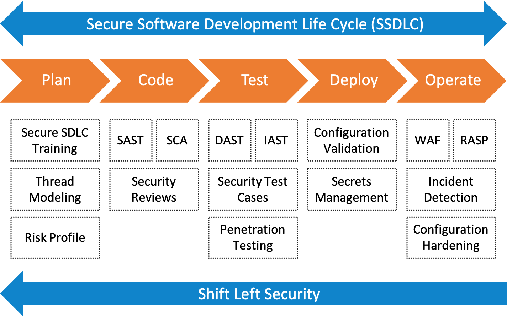

## Hemos sido hackeados

Una brecha de seguridad, específicamente una vulnerabilidad de Inyección SQL, le ha dado a un hacker la capacidad de comprometer las consultas SQL que la aplicación envía a la BD, y mediante esto ha obtenido acceso a la información confidencial almacenada en la BD, como nombres, contraseñas, detalles de contacto e incluso detalles de tarjetas de crédito.

El equipo está corrigiendo la vulnerabilidad como prioridad 1, pero además necesita **poner en marcha un proceso para evitar que se repita el hack**.

## Shift Left Security

Shift Left Security implica mover las actividades de seguridad más hacia la izquierda dentro proceso del ciclo de vida de software.

**Beneficios:**
- Prevenir que problemas de seguridad sean introducidos en el código.
- Si se llega a introducir un problema, encontrarlo temprano y resolverlo a bajo costo; esto a su vez reduce riesgos, embebe calidad desde el inicio, y mejora el tiempo de entrega.

**Cómo se realiza:**
- Involucrando a los especialistas de seguridad desde el inicio del proyecto.
- Entrenando y refornzando continuamente a las personas del equipo en temas de seguridad.
- Realizando actividades de seguridad desde la planificación y diseño, por ejemplo: Thread Modeling, Risk Profile.
- Realizan actividades de seguridad durante la codificación y building, por ejemplo: SAST (Static Application Security Testing), SSCA (Software Composition Analysis), Security Reviews.

