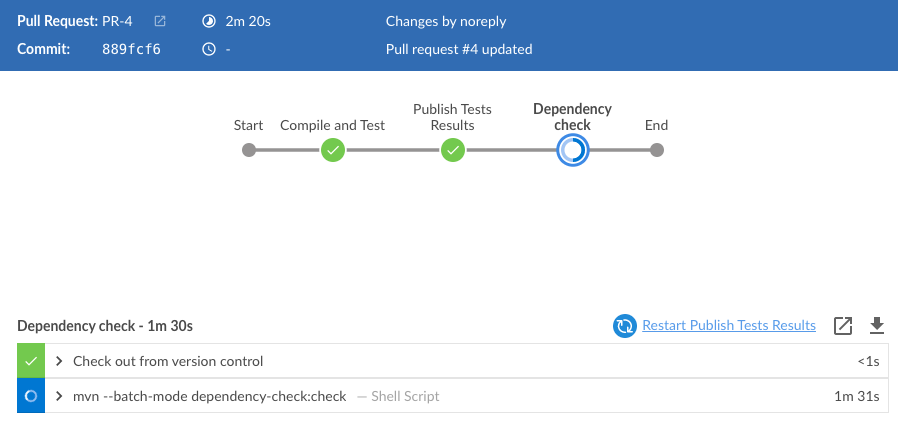
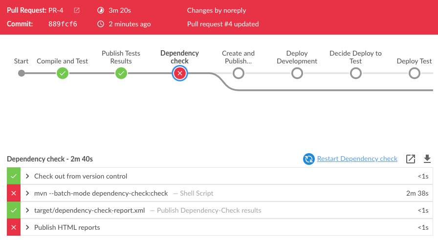
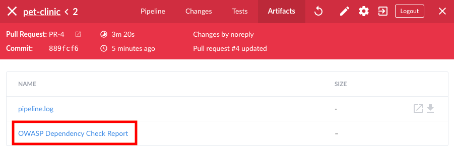
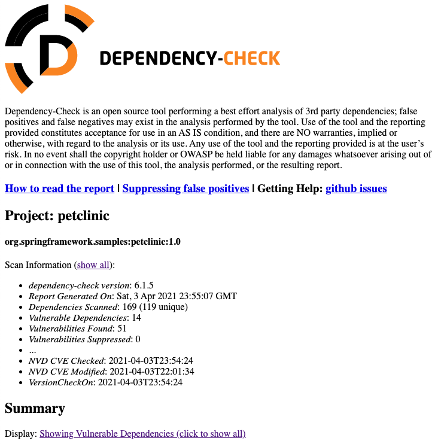
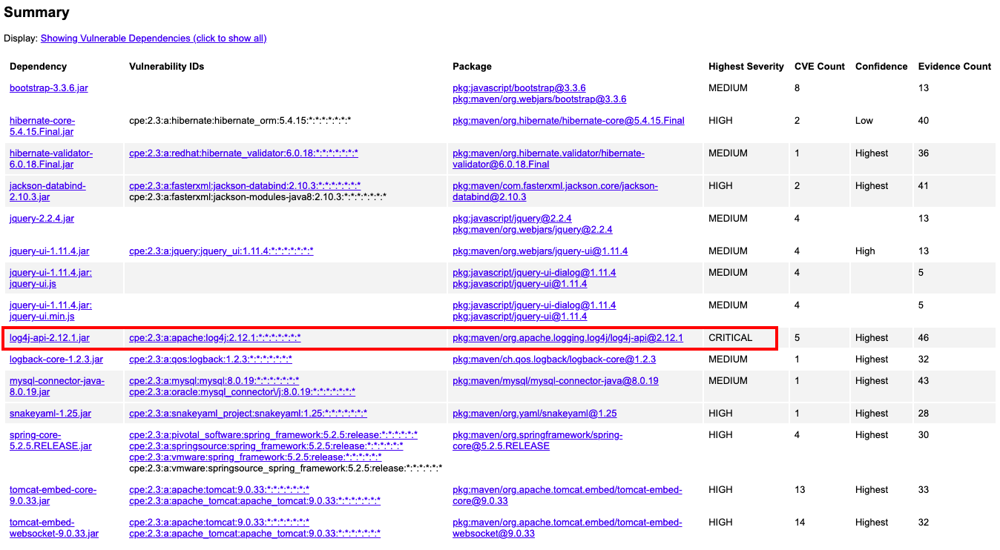
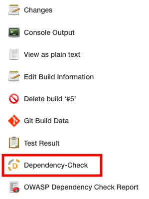
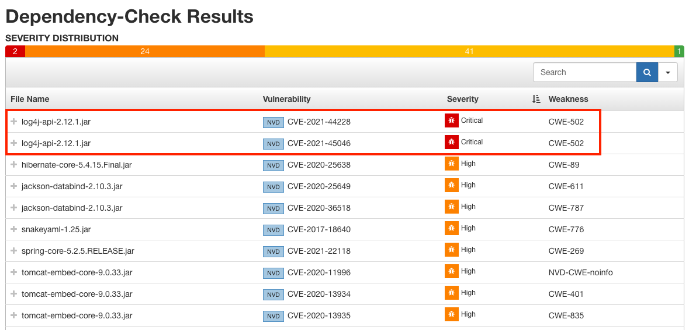

* Ingresa a Jenkins <a href="https://[[HOST_SUBDOMAIN]]-8080-[[KATACODA_HOST]].environments.katacoda.com/blue/organizations/jenkins/pet-clinic/#step6" target="jenkins">https://[[HOST_SUBDOMAIN]]-8080-[[KATACODA_HOST]].environments.katacoda.com/blue/organizations/jenkins/pet-clinic/</a>

* Observarás que está en progreso la ejecución asociada al último Pull Request `PR-X`.

* **Deten la ejecución de los otros builds** para acelerar la ejecución del último `PR-X`, haz click en el ícono  al lado de cada ejecución que quieres detener.

* Haz click en la ejecución para revisar su detalle.

* Espera a que finalice la ejecución.
  La etapa `Dependency check` demorará varios minutos en la primera ejecución, ya que actualiza su BD de Vulnerabilidades (en base a [NVD](https://nvd.nist.gov/vuln/data-feeds) y otras fuentes de información), además de identificar el catálogo de componentes y revisar si existen vulnerabilidades asociadas a estos componentes.

  

* La ejecución fallará ya que se ha encontrado vulnerabilidades.

  

* El pipeline almacenó un reporte detallado de todo el análisis, revisa el reporte haciendo click en el menú  de la parte superior derecha, luego en el enlace **OWASP Dependency Check Report**.

  

* Encontrarás un reporte detallado.

  

* En la sección de **Summary** de este reporte, observarás que **log4j-api** tiene una severidad de **CRITICAL**.

  

* Regresa a Jenkins para revisar un reporte resumido, haz click en el ícono  de la parte superior derecha para mostrar la vista clásica de Jenkins.

* En la vista clásica, ingresa a la opción **Dependency-Check** del menu de la izquierda.

  

* Observarás un reporte resumido de las vulnerabilidades encontradas, ordénalo por **Severity** para identificar las vulnerabilidades más importantes.

  

  ✏ **Nota**: 
  - `CVE` (Common Vulnerabilities and Exposures) es una lista de vulnerabilidades de seguridad divulgadas públicamente. Cuando alguien se refiere a un CVE, se refiere a una falla de seguridad a la cuál se le ha asignado un número de identificación `CVE-XXX`. 
  - `CWE` (Common Weakness Enumeration) es una lista de categorías de las vulnerabilidades más comunes.
