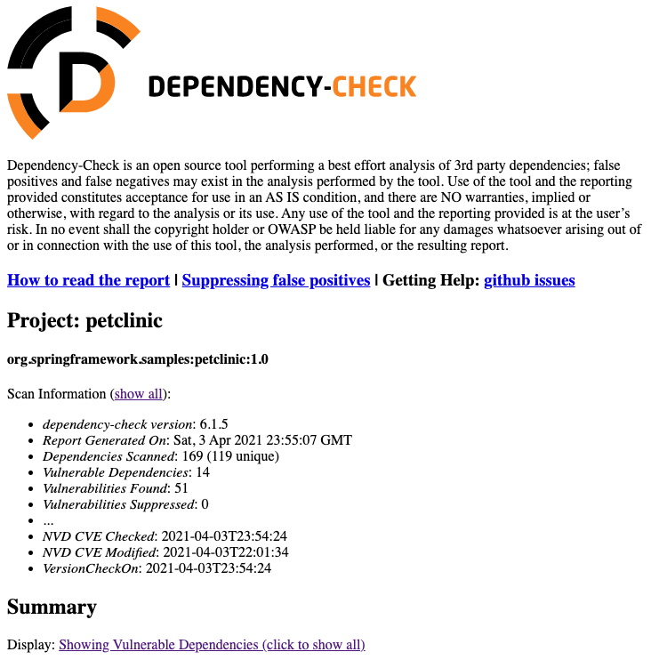
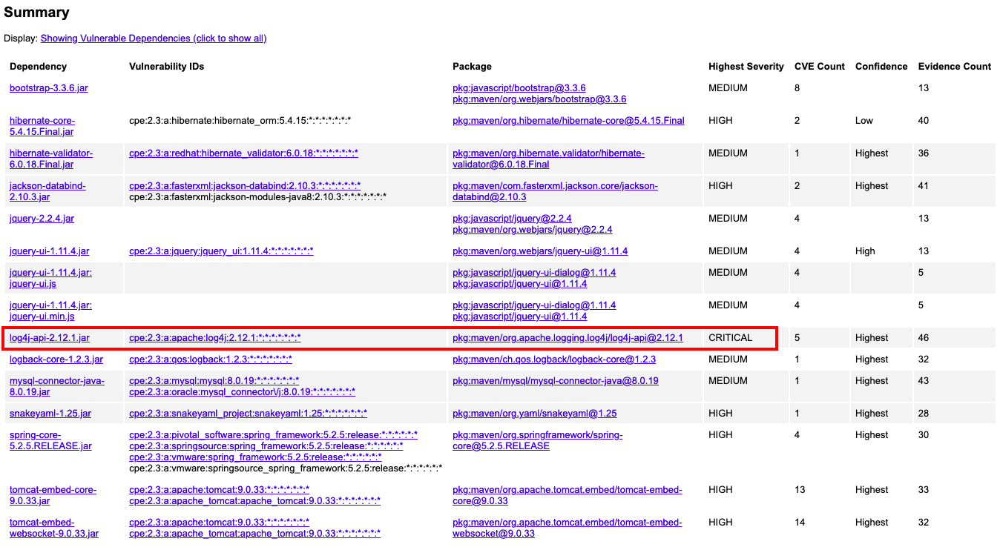
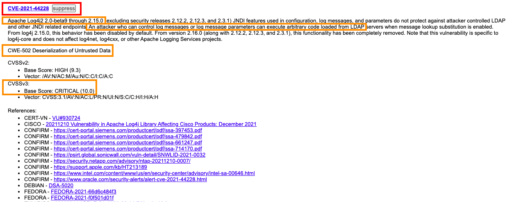
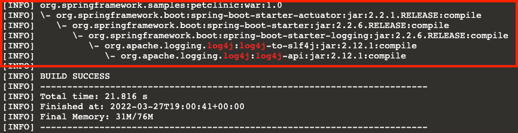
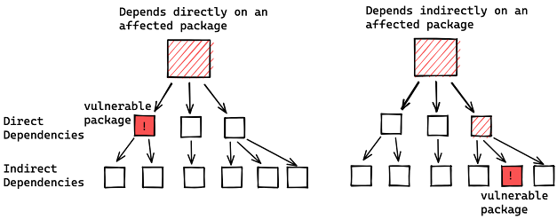
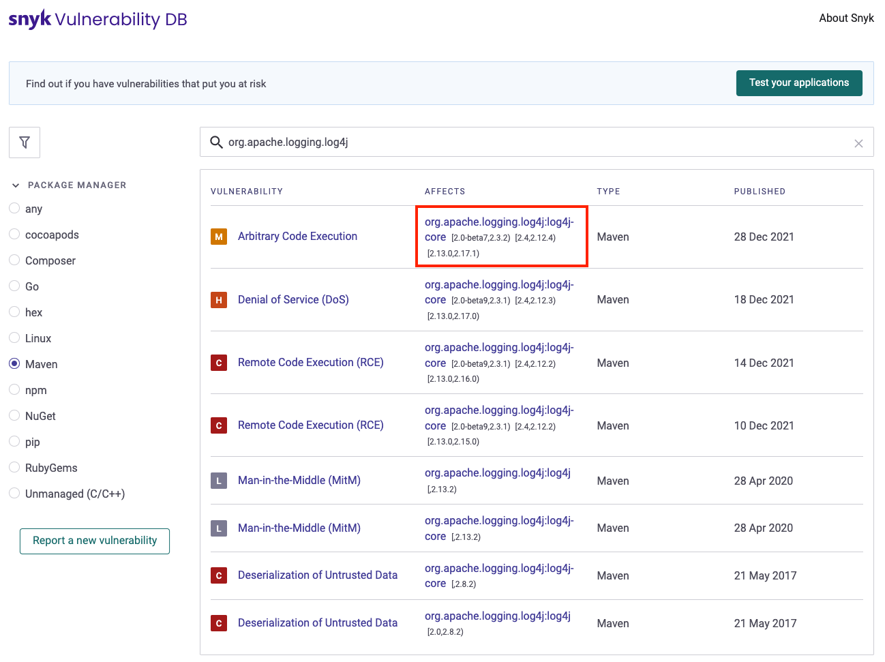
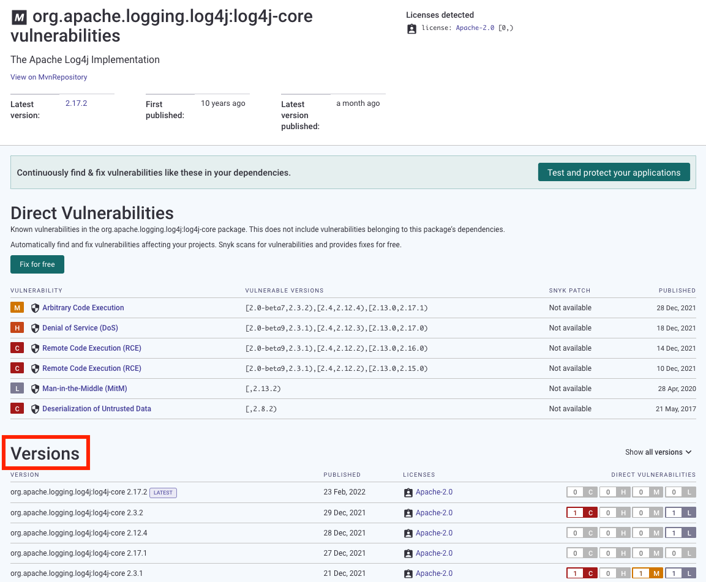
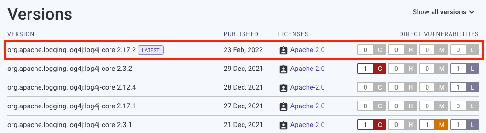
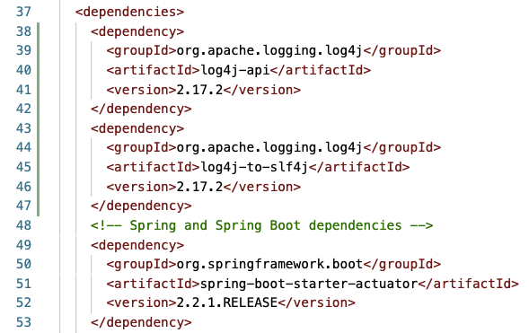
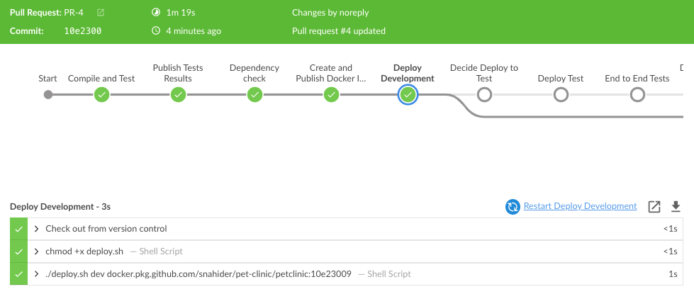

Aún si la aplicación que construyes es segura, pueden existir vulnerabilidades en el sistema operativo, librerías, y cualquier otra dependencia en la que se basa la aplicación.

De acuerdo a los reportes anteriores, existe al menos la librería **log4j** que tiene una vulnerabilidad crítica (CVSS>9).

## Analiza la vulnerabiliad

* Regresa al reporte detallado que se encuentra abierto en otro tab.

  

* En la parte de **Summary** haz click en **log4j-api** para revisar el detalle.

  

* En el detalle desplázate un poco hacia abajo hasta su vulnerabilidad **CVE-2021-44228** (que es la vulnerabilidad con más alto CVS, CRITICAL 10.0)

  

* Revisa su contenido:
  * **Apache Log4j2 2.0-beta9 through 2.15.0**: afecta hasta la versión `2.15.0` (aunque si revisas el siguiente CVE encontrás otra vulnerabilidad que afecta hasta la `2.17.0`)
  * **An attacker who can control log messages or log message parameters can execute arbitrary code from LDAP**: un atacante podría ejecutar código de manera remota.
  * **CWE-502 Deserialization of Untrusted Data**: esta categoría de vulnerabilidad significa que se recibe data de fuentes no confiables sin verificar sea válida.
  * **CVS Critical (10.0)**: 10 es la valoración más alta de criticidad.
  
## Analiza las dependencias en tu proyecto

* Ejecuta el siguiente comando para identificar todas las dependencias de `log4j` que existen en el proyecto.

  `(cd pet-clinic && mvn dependency:tree -Dincludes=org.apache.logging.log4j | grep --color -E "log4j|$")`{{execute}}

  

* Observarás que el proyecto depende indirectamente de `log4j` (dependencias de tus dependencias).

  

## Busca versiones parchadas de los componentes con vulnerabilidad

* Ingresa a la BD de Vulnerabilidades de Snyk (herramienta comercial de SCA) [https://snyk.io/vuln/?type=maven](https://snyk.io/vuln/?type=maven)

* Busca `org.apache.logging.log4j`{{copy}}, e ingresa al primer enlace que contiene el nombre del componente.

  

* En la nueva página se listará un resumen de las vulnerabilidades asociadas al componente, asi como el listado de versiones del componente con su respectiva cantidad de vulnerabilidades. Desplázate hasta el **listado de versiones**.

  

* Busca cuál es versión más reciente del componente sin vulnerabilidades.
    * Para no desestabilizar el código fuente, busca primero manteniendo la misma versión `major` y la última versión a la fecha `minor`.
    * Por ejemplo nuestra versión actual es `2.12.1`, mantenemos el `2.Y.Z` y buscamos el último `Y.Z`.

* A la fecha es la versión **2.17.2**.

  

## Actualiza las versiones de las dependencias en el POM

* Abre el archivo [`pom.xml`](https://[[HOST_SUBDOMAIN]]-9876-[[KATACODA_HOST]].environments.katacoda.com/#pom-deps-check) de la rama `deps-check`.

* Para editar el archivo, has click en el **ícono de lapiz** en la parte superior derecha del archivo.

* Debido a que `log4j-to-slf4j` y `log4j-api` son dependencias indirectas, no se encuentran declaradas en el `pom.xml`. Para corregir su versión necesitamos declararlas 

* Aproximadamente **debajo de línea 37**, debajo de `<dependencies>`, presiona `ENTER` y agrega el siguiente fragmento:

  <pre class="file" data-target="clipboard">
  &lt;dependency&gt;
          &lt;groupId&gt;org.apache.logging.log4j&lt;/groupId&gt;
          &lt;artifactId&gt;log4j-api&lt;/artifactId&gt;
          &lt;version&gt;2.17.2&lt;/version&gt;
  &lt;/dependency&gt;
  &lt;dependency&gt;
          &lt;groupId&gt;org.apache.logging.log4j&lt;/groupId&gt;
          &lt;artifactId&gt;log4j-to-slf4j&lt;/artifactId&gt;
          &lt;version&gt;2.17.2&lt;/version&gt;
  &lt;/dependency&gt;
  </pre>

* Debe quedar similar a la siguiente imagen.

  

* En la sección **Commit changes**, ingresar el comentario `Upgrade log4j to 2.17.2`{{copy}}.

* Realiza commit en la misma rama `deps-check`.

## Revisa los resultados de la ejecución del Pipeline

* Ingresa a Jenkins <a href="https://[[HOST_SUBDOMAIN]]-8080-[[KATACODA_HOST]].environments.katacoda.com/blue/organizations/jenkins/pet-clinic/#step7" target="jenkins">https://[[HOST_SUBDOMAIN]]-8080-[[KATACODA_HOST]].environments.katacoda.com/blue/organizations/jenkins/pet-clinic/</a>

* Observarás que está en progreso la ejecución de un pipeline asociado al Pull Request `PR-X`.

* Haz click en la ejecución `PR-X` para revisar su detalle, y espera a que finalice la ejecución.

* La ejecución terminará exitosamente.

  

## Revisa el reporte resumido de vulnerabilidades

* Haz click en el ícono  de la parte superior derecha, para regresar a la vista clásica de Jenkins.

* En la vista clásica, ingresa a la opción **Dependency-Check** del menu de la izquierda.

  

* En la página con el reporte de vulnerabilidades, ordena las vulnerabilidades por severidad, observarás que ya no existen vulnerabilidades críticas.

  