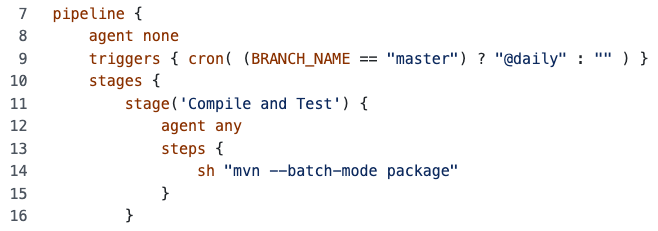

Ahora que tenemos el análisis SCA ejecutándose por cada cambio y hemos corregido las vulnerabilidades críticas, podemos escanear diariamente en búsqueda de vulnerabilidades descubiertas.

## Programa el Pipeline para que se ejecute diariamente

* Abre el archivo [`Jenkinsfile`](https://[[HOST_SUBDOMAIN]]-9876-[[KATACODA_HOST]].environments.katacoda.com/#jenkinsfile-deps-check) de la rama `deps-check`.

* Para editar el archivo, has click en el **ícono de lapiz** en la parte superior derecha del archivo.

* Aproximadamente **debajo de la línea 8**, debajo de la línea `agent none`, presionar `ENTER` y agrega el siguiente fragmento:

  <pre class="file" data-target="clipboard">
  triggers { cron( (BRANCH_NAME == "master") ? "@daily" : "" ) }
  </pre>
  
  ✏ **Notas**: 
  - El bloque `triggers {}` permite programar la ejecución a determinadas horas o intervalos de tiempo.
  - El `trigger` se ejecutará sobre la rama `master` para asegurar que la rama principal siempre se encuentra estable.

* Deberá quedar similar a la siguiente imagen.

  

* En la sección **Commit changes**, ingresa el comentario `OWASP Dependency Check: daily execution`{{copy}}

* Realiza commit en la misma rama `deps-check`{{copy}}.

* Ingresa al listado de pull requests en GitHub [https://github.com/[your_username]/pet-clinic/pulls](https://[[HOST_SUBDOMAIN]]-9876-[[KATACODA_HOST]].environments.katacoda.com/#pr) y abre el pull request relacionado al Dependency Check.

* Para propósitos del laboratorio no es necesario que esperes que termine la ejecución.

* Realiza el merge del pull request haciendo click en el botón **Merge pull request** y confirma el merge haciendo click en **Confirm Merge**.